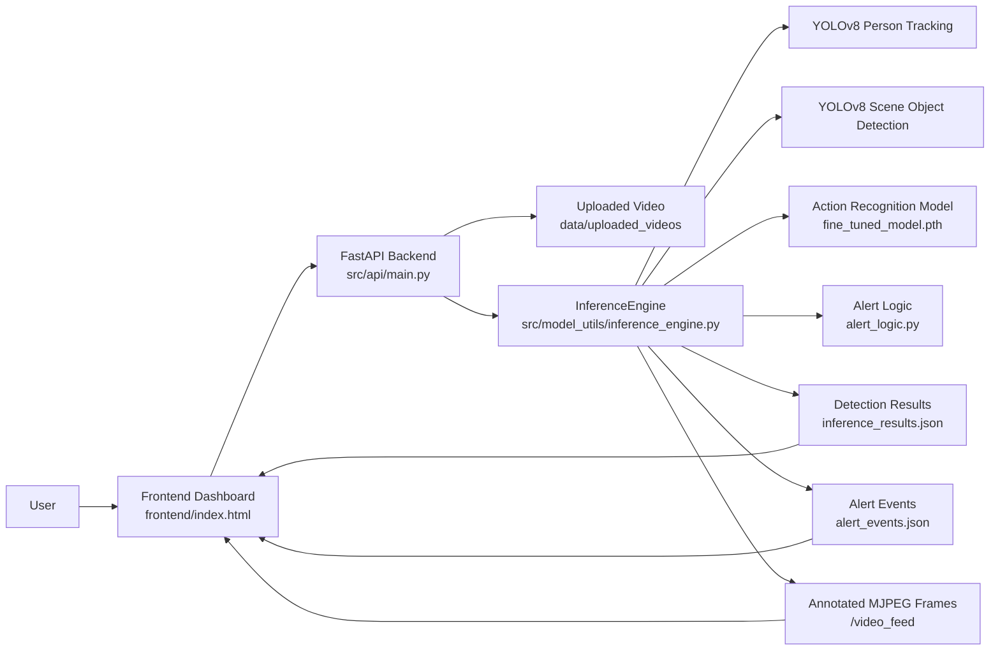
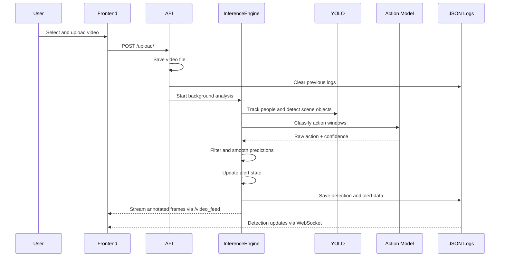
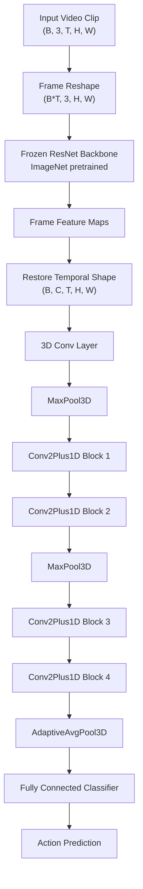
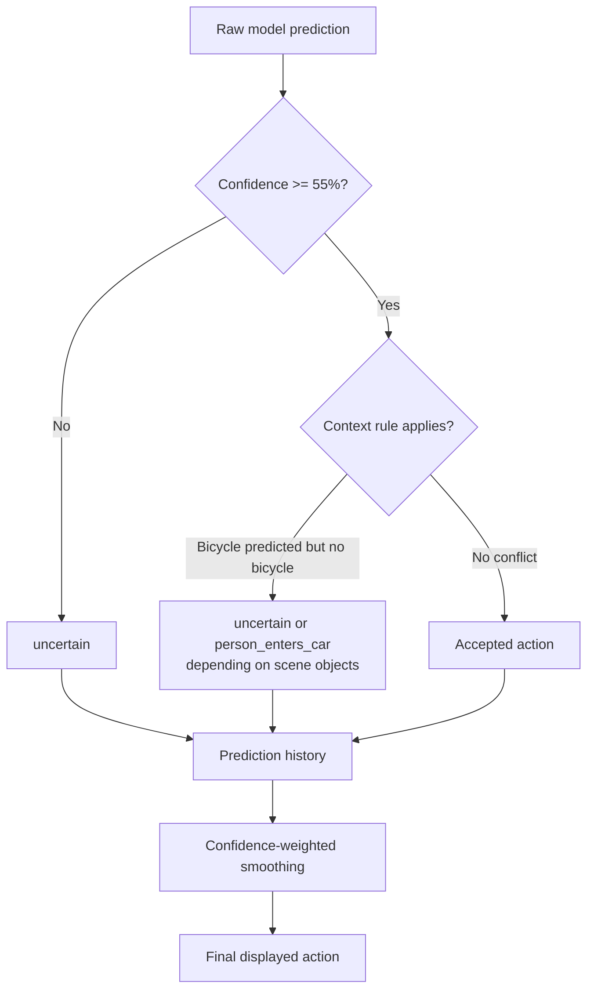
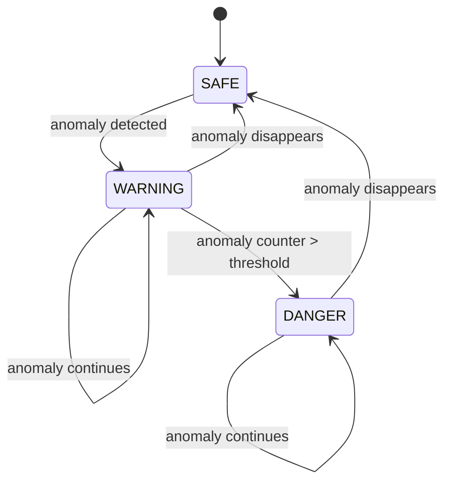

# Human Behavior Recognition in Video Streams

Final project documentation for **Problem Workshop in Software Engineering**.

## Team

- Zuzanna Adamczyk
- Praskovya Horbach
- Tobiasz Kowalczyk
- Silchankava Nadzeja
- Magdalena Synowiec
- Beata Szczesna

## Project Overview

This project implements a video-based human behavior recognition system. The system allows a user to upload a video, analyzes the video in the background, detects and tracks people, classifies selected human actions, identifies potentially dangerous behavior, and presents the results in a web dashboard.

The project uses a custom PyTorch action recognition model together with YOLOv8-based person tracking and scene object detection.

Main goals:

- detect people in uploaded videos,
- classify selected human actions,
- track detected people across frames,
- show live annotated video output,
- provide confidence scores for predictions,
- detect alert states such as `SAFE`, `WARNING`, and `DANGER`,
- include simple scene context such as detected objects and environment type,
- provide a usable web dashboard for demonstration and testing.

## Main Features

- FastAPI backend.
- HTML/CSS/JavaScript frontend dashboard.
- Video upload and background processing.
- Live MJPEG video feed with bounding boxes.
- YOLOv8 person tracking.
- YOLOv8 scene object detection.
- PyTorch action recognition model.
- Fine-tuning pipeline for selected classes.
- Temporal smoothing of predictions.
- Confidence-based `uncertain` output.
- Context-aware filtering rules.
- Alert logic for suspicious behavior.
- JSON-based detection and alert logs.
- Docker-based local deployment.

## Project Structure

```text
.
+-- Dockerfile
+-- docker-compose.yml
+-- README.md
+-- PROJECT_DOCUMENTATION.md
+-- requirements.txt
+-- frontend/
|   +-- index.html
+-- models/
|   +-- best_model.pth
|   +-- fine_tuned_model.pth
|   +-- learning_statistics.txt
|   +-- fine_tuning_stats.txt
+-- src/
|   +-- api/
|   |   +-- main.py
|   +-- dataset_utils/
|   |   +-- category_list.txt
|   |   +-- clean_jsonl.py
|   |   +-- copy_balanced_subset.py
|   |   +-- filter_pip370k.py
|   |   +-- validate_annotations.py
|   +-- model_utils/
|   |   +-- alert_logic.py
|   |   +-- baseline_model.py
|   |   +-- fine_tuning.py
|   |   +-- inference_engine.py
|   |   +-- model_settings.json
|   |   +-- inference_results.json
|   |   +-- alert_events.json
|   +-- data_pipeline.py
|   +-- eda.py
|   +-- setup_data.py
+-- tests/
```

## Docker Usage

Build the image:

```bash
docker compose build api
```

Start the application:

```bash
docker compose up
```

Open the dashboard:

```text
http://localhost:8001
```

Stop the application:

```bash
docker compose down
```

Run fine-tuning:

```bash
docker compose run --rm api python -m src.model_utils.fine_tuning
```

The model is saved only when validation accuracy improves. If training is stopped during an epoch, the last fully saved best model remains in `models/fine_tuned_model.pth`.

Run command-line inference:

```bash
docker compose run --rm api python -m src.model_utils.inference_engine --video path/to/video.mp4
```

The Compose file also defines a `clip_cache` named volume reserved for optional cache experiments. The current fine-tuning path does not rely on this cache by default.

## Important Output Files

| File | Purpose |
|---|---|
| `models/best_model.pth` | Baseline trained model |
| `models/fine_tuned_model.pth` | Current fine-tuned model used by inference |
| `models/learning_statistics.txt` | Baseline training logs |
| `models/fine_tuning_stats.txt` | Fine-tuning metrics |
| `src/model_utils/inference_results.json` | Detection result log |
| `src/model_utils/alert_events.json` | Alert transition log |

Uploaded videos are stored in:

```text
data/uploaded_videos
```

Training videos are expected in:

```text
data/videos/<class_name>/
```

## System Architecture

The system is divided into four main layers:

- **Frontend**: uploads videos and displays live results.
- **API backend**: receives uploads, starts background analysis, and serves results.
- **Inference engine**: tracks people, runs action recognition, applies filtering, and updates alerts.
- **Model layer**: contains the YOLO models and the custom PyTorch action recognition network.



## Runtime Data Flow

When a video is uploaded, the backend saves it, clears previous logs, and starts background analysis. The inference engine reads frames from the uploaded video, detects people, tracks them, creates frame windows, classifies actions, applies post-processing, updates alert states, and streams annotated frames back to the frontend.



## Model Architecture

The action recognition model is implemented in:

```text
src/model_utils/baseline_model.py
```

The model uses an ImageNet-pretrained ResNet backbone for spatial feature extraction and custom 3D temporal convolution blocks for video sequence modeling.



Current model settings are stored in:

```text
src/model_utils/model_settings.json
```

```json
{
  "HEIGHT": 244,
  "WIDTH": 224,
  "FRAMES_COUNT": 20,
  "FRAME_STEP": 5,
  "BATCH_SIZE": 2,
  "EPOCHS": 5
}
```

Input tensor shape:

```text
(batch_size, channels, frames, height, width)
```

Current example:

```text
(B, 3, 20, 244, 224)
```

## Dataset and Classes

The project uses the PIP 370k stabilized dataset as the main source of video data.

The baseline dataset contains 9 categories:

```text
person_embraces_person
person_enters_car
person_holds_hand
person_picks_up_object
person_reads_document
person_rides_bicycle
person_shakes_hand
person_steals_object
person_talks_on_phone
```

The current fine-tuned model focuses on 4 action classes:

```text
person_steals_object
person_enters_car
person_rides_bicycle
person_picks_up_object
```

During inference, the system may also output:

```text
uncertain
```

`uncertain` is not a trained class. It is a post-processing result used when the raw model prediction is not trusted enough or does not match scene context.

## Training and Fine-Tuning

### Baseline Training

Baseline training is implemented in:

```text
src/model_utils/model_training.py
```

The baseline model is trained on the full 9-class action dataset and saved to:

```text
models/best_model.pth
```

### Fine-Tuning

Fine-tuning is implemented in:

```text
src/model_utils/fine_tuning.py
```

The fine-tuning pipeline:

- uses 4 selected classes,
- currently uses all available samples from the selected classes (`FINE_TUNE_SAMPLES = None`),
- can still use a balanced subset if `FINE_TUNE_SAMPLES` is set to a number,
- uses deterministic random seeds,
- loads compatible weights from `models/best_model.pth`,
- skips incompatible final classifier weights,
- uses random clips for training,
- uses deterministic center clips for validation,
- saves the model to `models/fine_tuned_model.pth`,
- saves statistics to `models/fine_tuning_stats.txt`.

Fine-tuning command:

```bash
docker compose run --rm api python -m src.model_utils.fine_tuning
```

## Results

### Baseline Training Results

Recorded baseline training results from `models/learning_statistics.txt`:

| Epoch | Train Accuracy | Validation Accuracy |
|---:|---:|---:|
| 1 | 0.3233 | 0.4153 |
| 2 | 0.4194 | 0.4708 |
| 3 | 0.4644 | 0.4699 |
| 4 | 0.4948 | 0.4978 |
| 5 | 0.5174 | 0.5083 |
| 6 | 0.5388 | 0.5153 |
| 7 | 0.5558 | 0.5124 |

Best recorded baseline validation accuracy:

```text
0.5153
```

### Fine-Tuning Results

Previous recorded fine-tuning results:

| Epoch | Loss | Train Accuracy | Validation Accuracy |
|---:|---:|---:|---:|
| 1 | 0.9571 | 0.5988 | 0.7300 |
| 2 | 0.6999 | 0.7375 | 0.7150 |
| 3 | 0.6189 | 0.7612 | 0.7750 |
| 4 | 0.5159 | 0.8137 | 0.7900 |
| 5 | 0.4584 | 0.8237 | 0.7250 |

Best fine-tuning validation accuracy:

```text
0.7900
```

Note: `models/fine_tuning_stats.txt` is overwritten at the start of every new fine-tuning run. If a run is restarted and interrupted early, the file may contain only the CSV header even though `models/fine_tuned_model.pth` still contains the last saved best model weights.

### Result Summary

| Model Stage | Classes | Best Validation Accuracy | Notes |
|---|---:|---:|---|
| Baseline training | 9 | 0.5153 | Full class set, baseline model |
| Fine-tuning | 4 | 0.7900 | Focused action subset, loaded baseline weights |

The fine-tuned model performs better on the selected 4-class task, but the system can still produce incorrect predictions on unseen or synthetic videos. This is expected because the model has no trained `unknown` class and must choose between the known classes before post-processing is applied.

## Inference Logic

Inference is implemented in:

```text
src/model_utils/inference_engine.py
```

The inference engine performs:

- frame reading with OpenCV,
- person tracking with YOLOv8,
- scene object detection with YOLOv8,
- model inference on frame windows,
- confidence filtering,
- context-aware prediction correction,
- temporal smoothing,
- alert state update,
- JSON result export,
- annotated video frame streaming.

### Prediction Filtering

Current confidence threshold:

```text
MIN_ACTION_CONFIDENCE = 55.0
```

If raw confidence is below 55%, the output becomes:

```text
uncertain
```

Current contextual rules:

- `person_rides_bicycle` requires a detected `bicycle`.
- If the model predicts `person_rides_bicycle`, but the scene contains `car` and no `bicycle`, the system maps the result to `person_enters_car`.

These rules reduce obviously inconsistent predictions, such as predicting bicycle riding when no bicycle is visible.

### Temporal Smoothing

Predictions are stored in a short history per tracked person. The system computes a confidence-weighted smoothed action from recent predictions. This reduces rapid flickering between classes.



## Alert Logic

Alert logic is implemented in:

```text
src/model_utils/alert_logic.py
```

Current anomaly class:

```text
person_steals_object
```

Current threshold:

```text
ALERT_THRESHOLD = 5
```

Alert states:

- `SAFE`
- `WARNING`
- `DANGER`

The system enters `WARNING` when an anomaly starts appearing. It enters `DANGER` when the anomaly persists for more than the configured threshold.



Alert events are saved to:

```text
src/model_utils/alert_events.json
```

Detection results are saved to:

```text
src/model_utils/inference_results.json
```

Both files are cleared when a new video is uploaded through the frontend.

## Frontend Dashboard

The frontend is implemented in:

```text
frontend/index.html
```

It provides:

- video upload form,
- live processed video feed,
- tracked person count,
- danger and warning counters,
- environment summary,
- latest detection details,
- live detection results table,
- alert state change table.

The video feed is served by:

```text
/video_feed
```

The video preview uses `object-fit: contain`, so unusual video aspect ratios are shown without cropping. This may create black bars around the video, which is expected.

The overlay label above detected people is drawn with a dark background and status-colored text:

- green for `SAFE`,
- yellow for `WARNING`,
- red for `DANGER`.

## API Endpoints

The backend is implemented in:

```text
src/api/main.py
```

| Method | Endpoint | Description |
|---|---|---|
| GET | `/status` | Health check endpoint |
| POST | `/upload/` | Uploads a video and starts analysis |
| GET | `/detections/latest` | Returns the latest detection result |
| GET | `/detections/history` | Returns all detection results |
| GET | `/alert-events` | Returns alert state transitions |
| GET | `/video_feed` | Streams annotated MJPEG frames |
| WS | `/ws/detections` | Sends detection updates through WebSocket |


## Testing

Tests are stored in:

```text
tests/
```

The test suite covers:

- data setup,
- data pipeline behavior,
- EDA utilities,
- model forward pass,
- inference helper behavior,
- alert logic.

Run tests locally:

```bash
pytest
```

Run tests inside Docker:

```bash
docker compose run --rm api pytest
```


